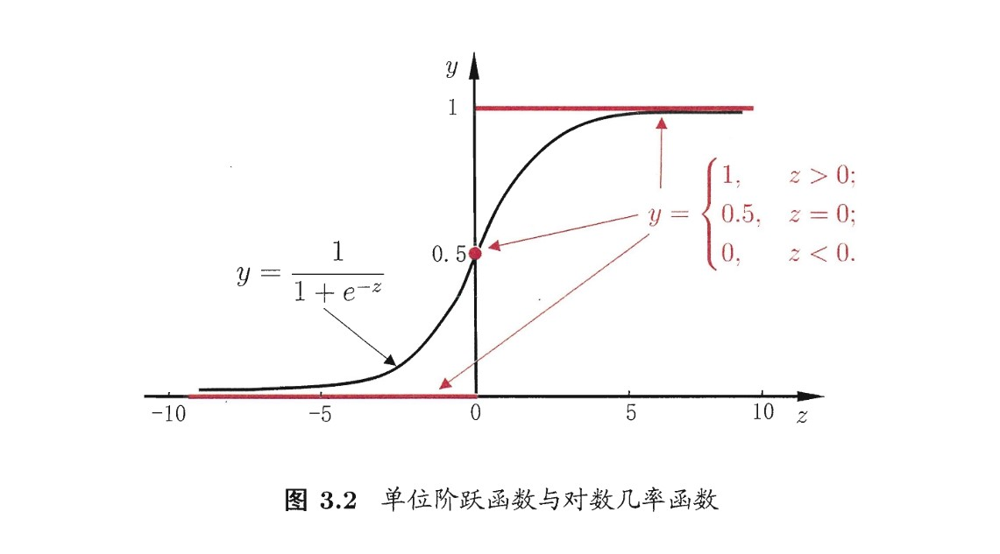
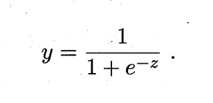
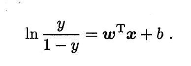
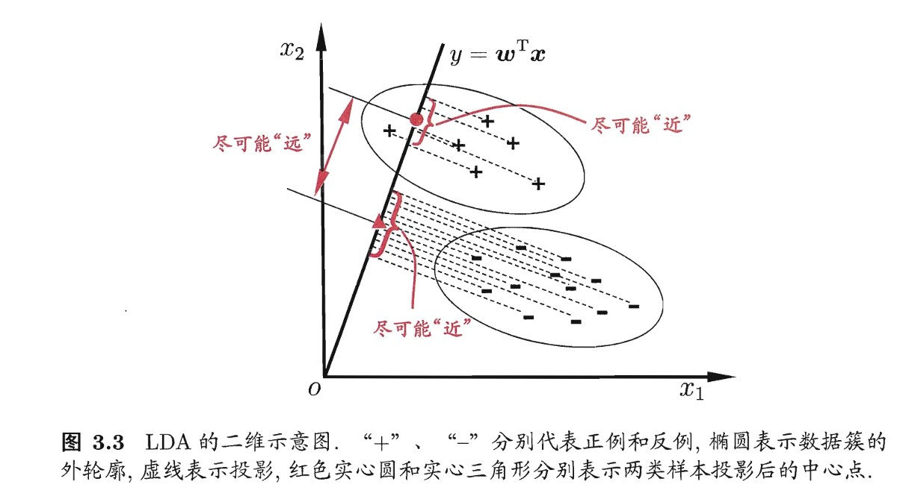
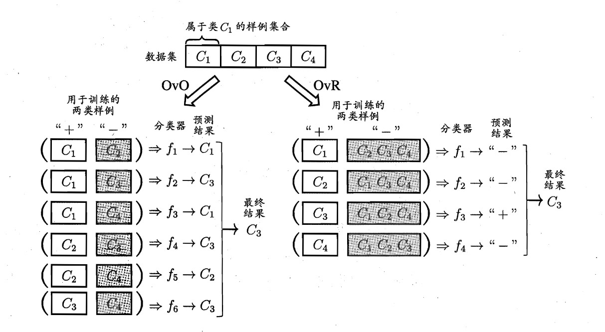

### 线性模型 ###
#### 约束 ####
1、行向量 (x1,x2,x3,……) 
2、列向量 (y1;y2;y3;……) 
#### 3.1 基本形式 ####
&emsp;f(x) = w1x1+w2x2+……+wdxd+b  
一般写成： 
&emsp;f(x) = WTX+b
#### 3.2 线性回归 ####
&emsp;线性回归试图学的一个线性模型以准确的预测实值输出标记 
对于离散属性： 
&emsp;若存在序的关系：连续化转化为连续值：{高，矮} => {1.0,0.5} 
&emsp;不存在序的关系：转化为k维向量：{西瓜，冬瓜，南瓜} =>{(1,0,0),(0,1,0),(0,0,1)}  
线性模型试图学的：f(xi) =wxi+b => f(xi)≈yi 
如何确定w和b： 
&emsp;均方误差最小化 
&emsp;(w*,b*) = argmin∑(f(xi)-yi)2=argmin∑(yi-wxi-b)2
&emsp;求解w和b使得误差最小化的过程称为最小二乘法 
&emsp;∂E/∂w = 2(w∑xi2-∑(yi-b)xi) 
&emsp;∂E/∂b = 2(mb-∑(yi-wxi) 
写成向量形式 
&emsp;w* = argmin(y-XW)T(y-XW) 
&emsp;当XTX为满秩矩阵或者正定矩阵时 
&emsp;W* = (XTX)-1XTy 
&emsp;如果不满足时，则可能求出多组解，选择那一组解作为输出，则由算法的归纳偏好决定，常见做法是引入正则化 
广义线性模型： 
&emsp;y=g-1(wTx+b) 
&emsp;当g(.)=ln(.)时为对数线性回归
#### 3.3对数几率回归 ####
单位阶跃函数： 
 
但是单位阶跃函数不连续，所以希望可以找到一个函数来替代他，对数几率函数就是这个函数 
 
带入得到 
 
y/1-y 为几率 
ln(y/1-u)称为对数几率 
#### 3.3 线性判别分析 ####
对于给定样本集,LDA试图将样本投影到一条直线上，使得同类样本离的尽可能近，异类样本距离尽可能远，在对新样本进行分类的时候，将其同样投影到这条直线上，根据其投影的点判断其类别 

#### 3.4 多分类学习 ####
可以将多分类学习进行拆分为多个二分类，具体而言可以为: 
===>1对1 
对于给定数据集，具有N个类别，将这N个类别两两配对，从而有N(N-1)/2个分类个二分类任务，最终结果通过投票产生。 
===>1对其余 
一对其余，训练N个分类器，每次将其中一个作为正例，其余作为反例，
===>多对多 

