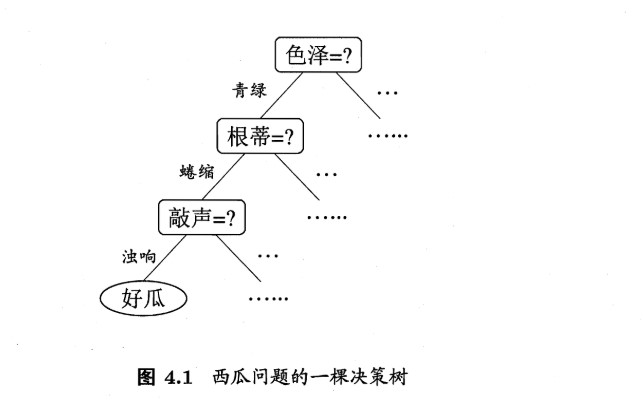
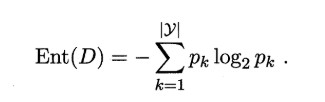
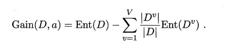
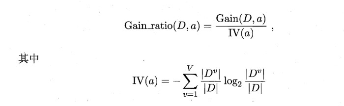
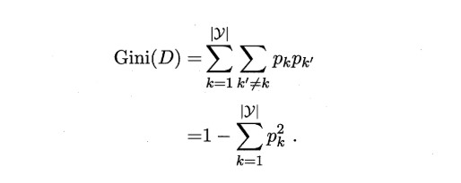

### 决策树 ###
 基于树结构进行决策,从根节点到叶节点的路径代表了一个判定序列 

#### 4.2划分选择 ####
1. 信息增益 
基于信息熵，度量样本纯度的指标 
 

ID3算法即使基于信息增益指标划分决策树。 
2. 增益率 
信息增益倾向于取值较多的属性，为了解决这个问题，增益率采用了一种启发式的策略，先从候选的划分集合中找出信息增益高于平均水平的属性，之后再从其中选择增益率最大的属性。 
 
3. 基尼系数 
CART决策树采用基尼系数来划分属性，基尼系数反映了从数据集上选取两个样本，类别标记不一致的概率。 
 
#### 剪枝处理 ####      
1. 预剪枝 
在决策树的生产过程中进行剪枝，对每个结点在划分前进行估计，如果当前节点的划分不能带来泛化性能的提高，则剪枝。
2. 后剪枝 
先生成一颗决策树，自底向上的进行考察，如果剪枝之后泛化性能提高，则剪枝。 
后剪枝决策树的欠拟合风险较小，泛化性能往往由于预剪枝。 
#### 连续和缺失值 
1. 连续值 
连续属性离散化，最简单就是对其进行二分划分。
2. 缺失值