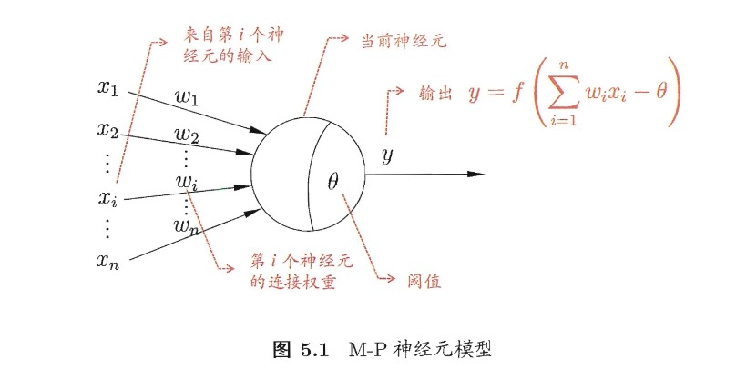
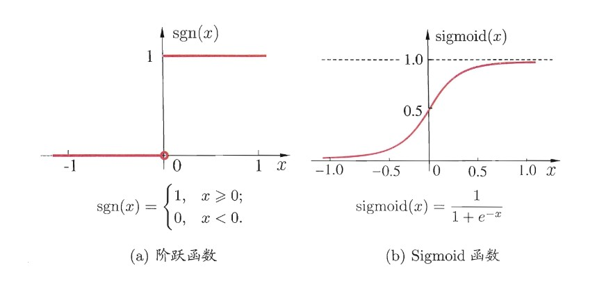
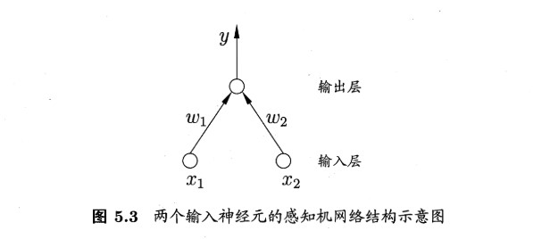
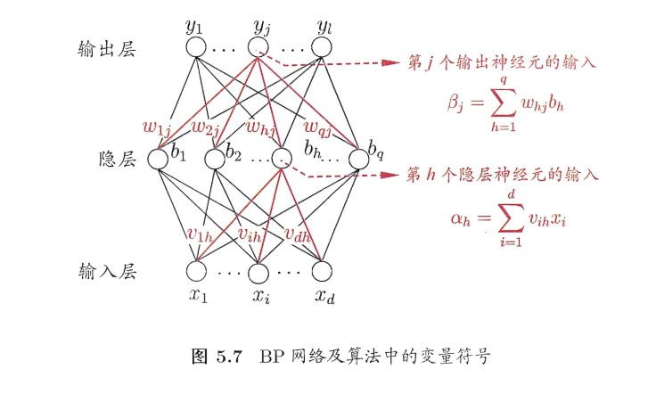
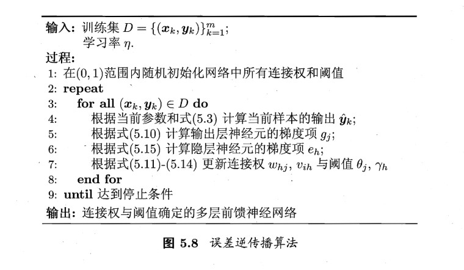
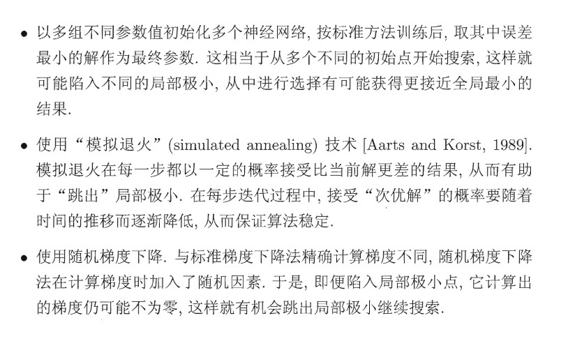

### 神经网络 ###
1. 神经元模型 
神经网络中最基本的成分就是神经元模型，每个神经元产生一个值，如果输出值超过该阈值就会产生兴奋。 
 
激活函数 
神经元通过激活函数处理其输出值， 

2. 感知机 
感知机由两层神经元组成，输入层接受外层输入信号后传给输出层，输出层是M-P神经元，亦称"阈值逻辑单元" 
感知机能处理与、或、非运算 
感知机只有输出层有激活函数处理，输入层没有，实际上感知机能处理的都是线性可分的情况，像异或这样的线性不可分的情况感知机是处理不了的 

要解决线性不可分的情形需要考虑多层神经网络，在输出层与输出层之间加入了隐藏层，输出层和隐藏层之间都是含有激活函数的功能神经元,称为"多层前馈神经网络" 
3. 误差逆传播算法-BP算法 

累计BP算法：批量更新 
标准BP算法：每次针对单个样本更新 
只需要一个任意多神经元的隐藏的的前馈神经网络，可以任意逼近任意复杂度的函数 
如何设置隐层神经元的个数，一般采用"试错法" 
学习率：控制参数的更新速度，太大则容易震荡，太小则收敛速度过慢 
4. 全局最优和局部最优 

5. 深度学习 
理论上说，模型的参数越多，复杂度越高，能完成更加复杂的任务，但训练的难度也越来越大。 
误差在多隐藏的神经网络训练时误差传播会发散 
无监督逐层训练: 
预训练：每次训练一层隐节点，然后将上一层的输出作为本层的输入，本层的输出作为下一层的输入。 
在整个网络训练完成后，对整个网络进行微调 
通过多层的神经网络，可以将低层的与目标联系不紧密的特征转化为高层的抽象的特征，从而用简单模型就可以完成复杂的分类任务 

